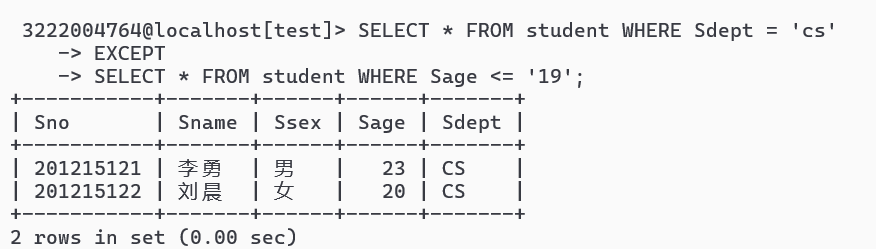

# 第七次作业

## 1.不采用Exists谓词实现SQL查询部分最后两个例子 

#### 例3.67 查询既选修了课程1又选修了课程2的学生。

#### 例3.68 查询计算机科学系的学生与年龄不大于19岁的学生的差集

## 2.分析教材上SQL查询部分最后两个例子的执行原理和内部详情

要求分析描述详尽，截图丰富。

#### 例3.67 查询既选修了课程1又选修了课程2的学生。

#### 执行原理：

**子查询**：

- 第一个查询 `SELECT Sno FROM sc WHERE Cno = '1'` 返回选修课程1的所有学生编号。

  

- 第二个查询 `SELECT Sno FROM sc WHERE Cno = '2'` 返回选修课程2的所有学生编号。
  

**INTERSECT 操作**：

- INTERSECT 操作符用于返回在两个查询结果集中的共同记录。
- 具体来说，数据库会找出同时出现在两个结果集中的学生编号。

#### 内部细节：

- 数据库系统会首先执行两个查询，生成两个结果集。
- 然后，它会逐行比较这两个结果集，找出那些在两个结果集中都存在的记录。
- 最终返回的结果集是同时选修了课程1和课程2的学生编号。

#### 例3.68 查询计算机科学系的学生与年龄不大于19岁的学生的差集

执行原理：

**子查询**：

- 第一个查询 `SELECT * FROM student WHERE Sdept = 'cs'` 返回所有计算机科学系的学生。
  
- 第二个查询 `SELECT * FROM student WHERE Sage <= '19'` 返回所有年龄不大于19岁的学生。
  

**EXCEPT 操作**：

- EXCEPT 操作符用于返回在第一个查询中存在但在第二个查询中不存在的记录。
- 具体来说，数据库会将第一部分的结果集与第二部分的结果集进行比较，找出第一部分中不在第二部分中的记录。

**内部细节**：

- 数据库系统会首先执行两个查询，生成两个结果集。
- 然后，它会逐行比较这两个结果集，找出那些在第一个结果集中但不在第二个结果集中的记录。
- 最终返回的结果集是计算机科学系的学生中那些年龄大于19岁的学生。
  