## 第三次作业

下载安装MySQL

### 1.打开mysql官方网站，下载压缩文件和文档

#### a.点击下载/DOWNLOAD

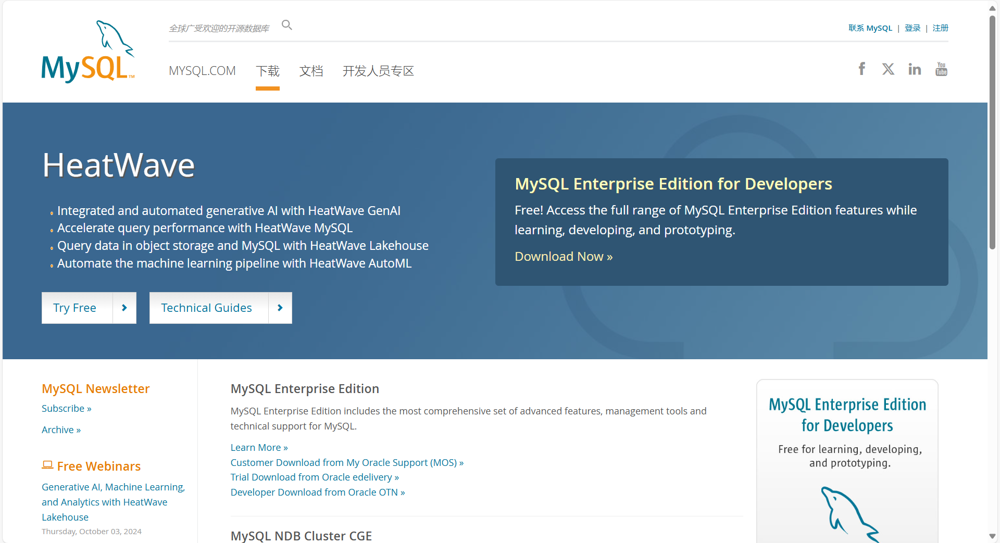

#### b.下滑至底层，点击红色框选部分的内容

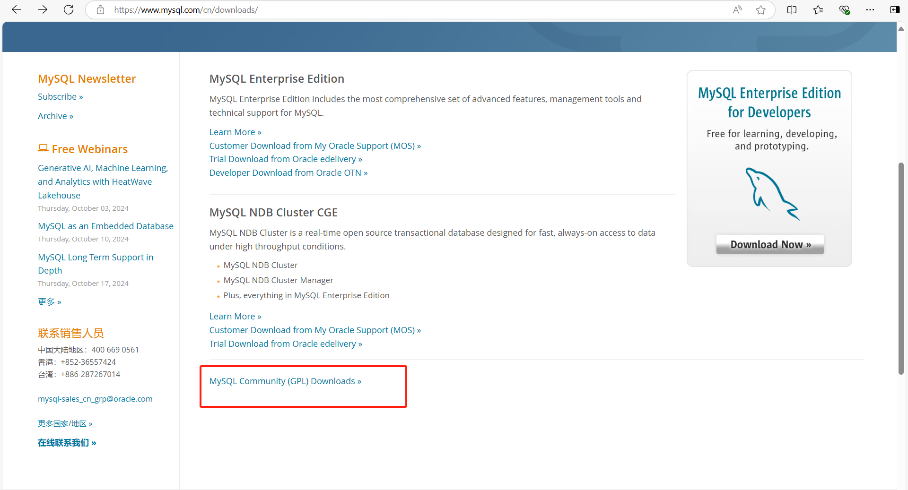

#### c.点击community server的版本

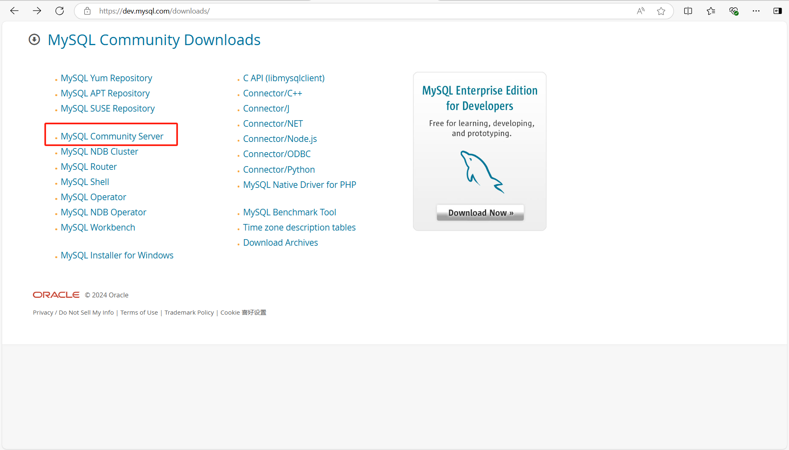

#### d.根据自己电脑的情况以及自身需求选择对应的系统和版本，点击.zip文件旁边的download

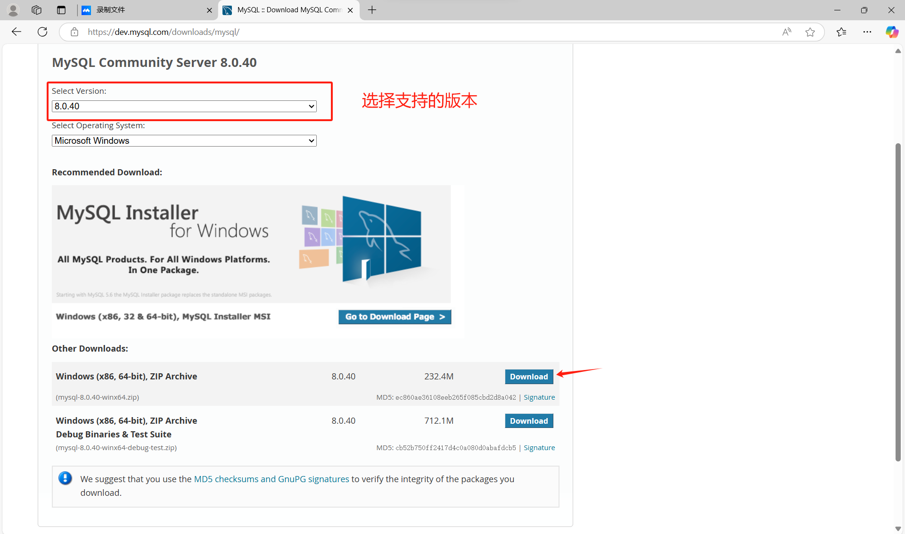

#### e.无需登陆，直接下载

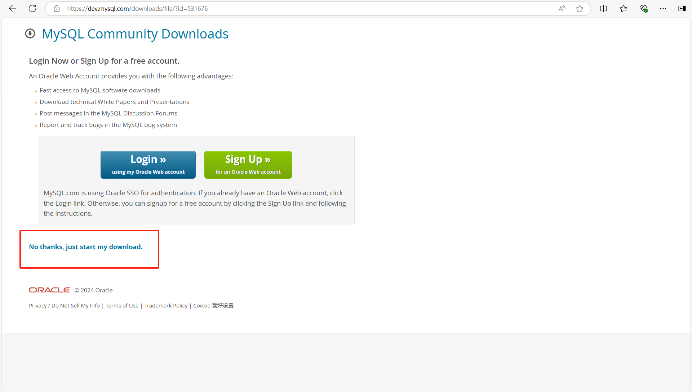

#### f.同时下载对应版本的文档，由于我适用的是最新版本，因此下载的是最新版本文档的pdf

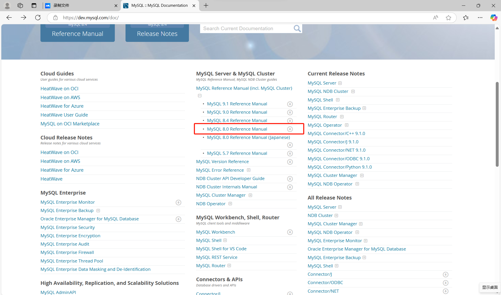

#### g.下载完毕后，在d盘（或者其他盘）创建mysql文件夹，把pdf文件和zip文件放入该文件夹中，zip文件解压

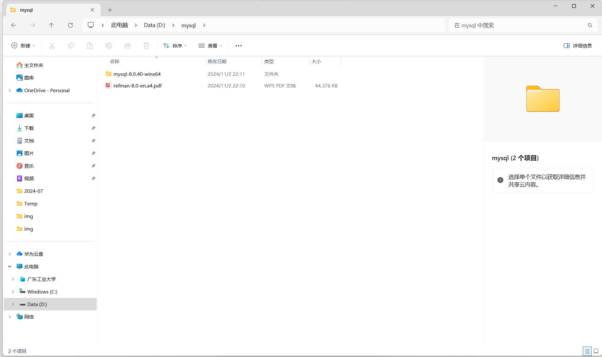

### 2.打开系统的命令提示符

#### a.可在开始处搜索找到

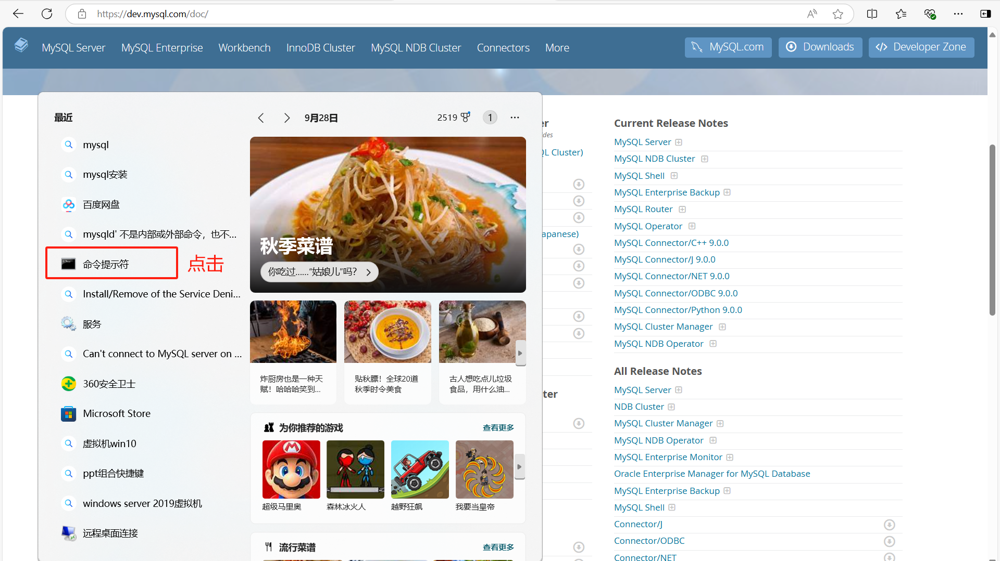

#### b.转换至mysql.exe文件所在的目录 直接输入d:

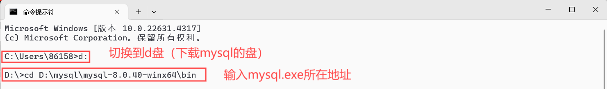

#### c.输入dir，查看文件

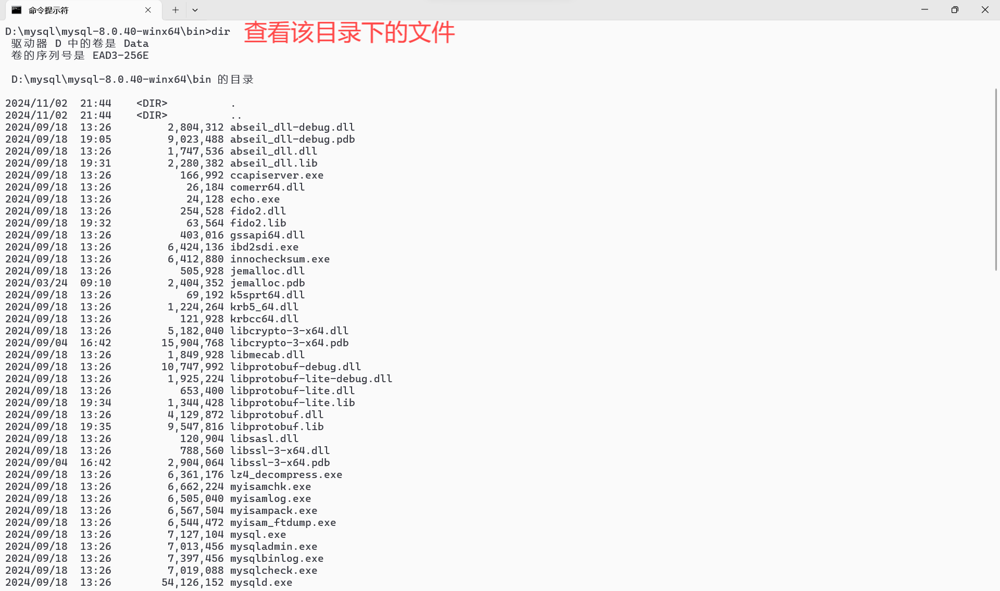

#### d.输入mysqld，发现第三行开始出错，原因是选择的版本mysql community server采用的是c/s模式，下载后server部分没有进行初始化，没有对应的data文件夹。

#### e.初始化，输入命令mysqld --console --initialize

切记不要关闭此窗口！！！

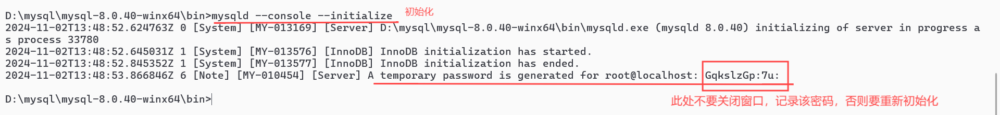

### 3.打开另一个控制台

#### a.在mysql.exe文件夹所处目录的搜索栏输入cmd

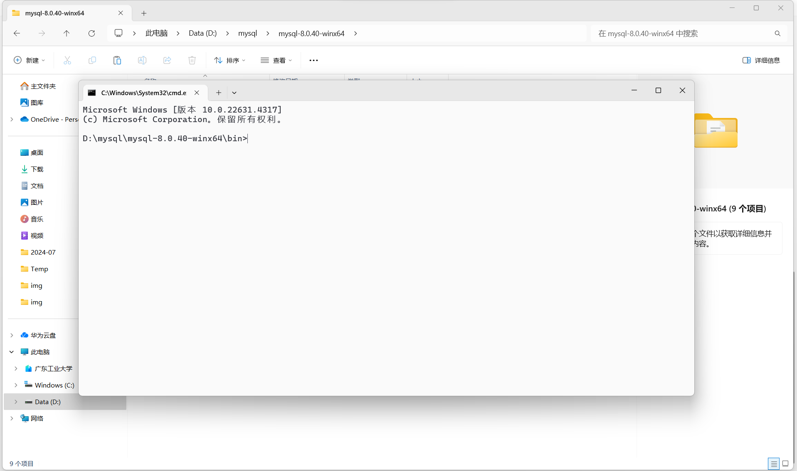

#### b.输入命令mysql -u root -p并输入临时密码

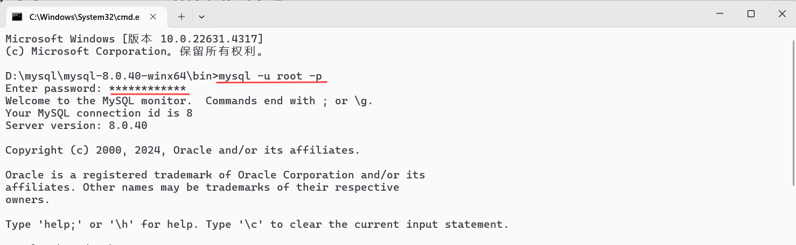

#### c.输入命令show databases；   但是发现出错，需要修改用户密码，故输入命令alter user 'root'@'localhost'identified by '新密码'（此处我使用的密码是abc1245）

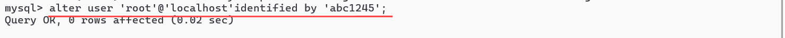

#### e.退出mysql，重新登入，输入mysql -u root -p并输入新密码，检验是否修改成功

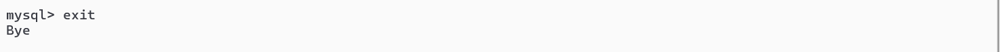

### 4.创建用户

#### a.输入prompt  \u@\h[\d]>(空格)

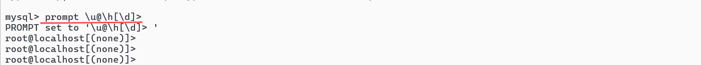

#### b.输入create user '学号'@'localhost'identified by '用户密码'；

#### c.授权，输入grant all on (星号).(星号) to '学号'@'localhost';

#### d.退出exit

### 5.修改提示符

#### a.输入mysql -u 刚刚创建的用户名 -p并输入密码

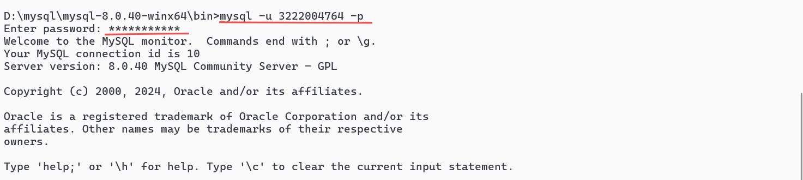

#### b.再次输入prompt  \u@\h[\d]>(空格)

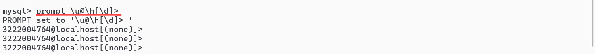

可以看见提示符已经改为学号
