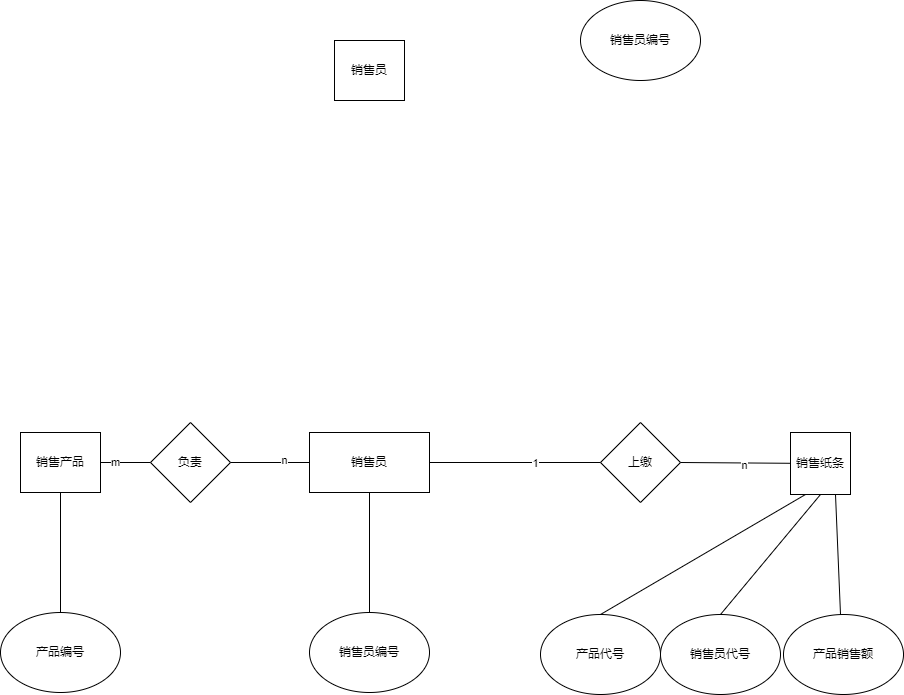

# 第二次作业

关于销售管理系统的具体信息详见[第一次作业](“./第一次作业/第一次作业.md”)

### 一、E-R图

针对上次的销售管理系统，有如下e-r图，具体文件为[e-r图](“./e-r图.drawio”)

！需要安装drawio软件/插件才能打开

### 二、数据表

#### 销售员表

销售员1

| 产品代号 | 产品日销售额 |
| -------- | ------------ |
| 1        | ..           |
| 2        | ..           |
| 3        | ..           |
| 4        | ..           |
| 5        | ..           |

销售员2

......

#### 产品表

| 销售员代号 | 产品日销售额 |
| ---------- | ------------ |
| 1          | ..           |
| 2          | ..           |
| 3          | ..           |
| 4          | ..           |

