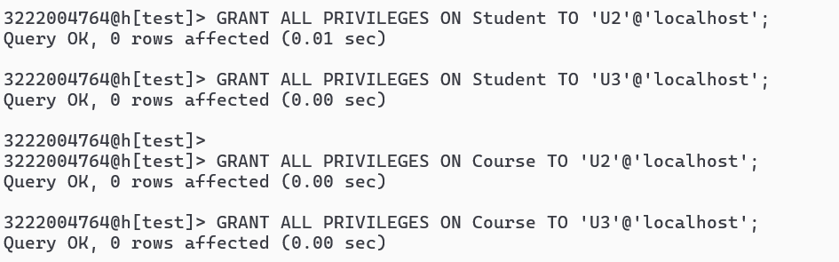
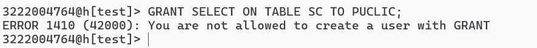
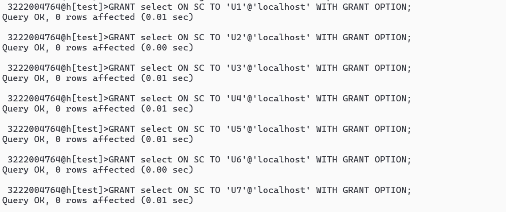
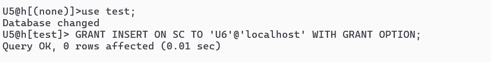
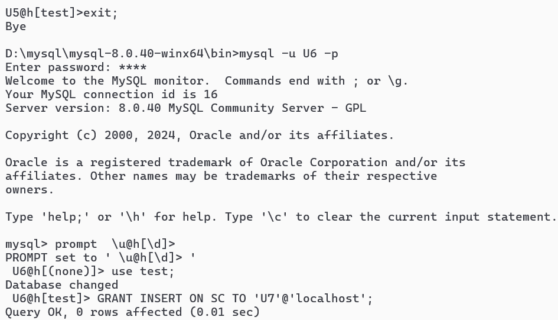
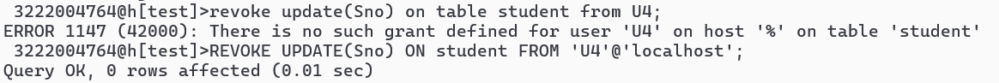
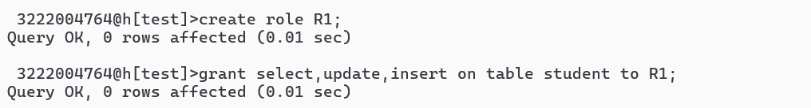
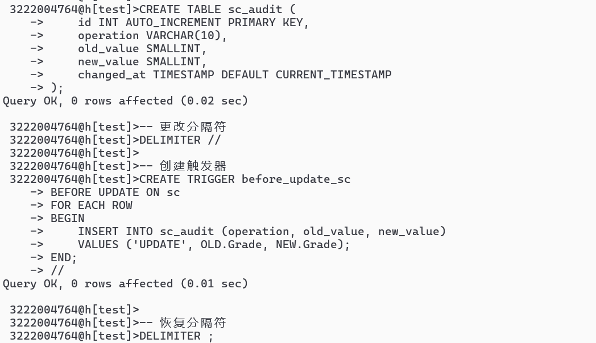
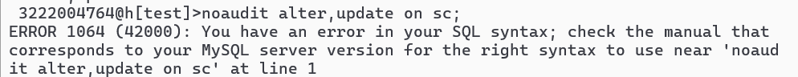
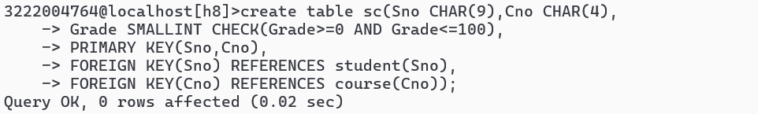

第八次作业

### 1.继续用MySql实际操作完成第4，5章例子。 

#### 第四章例子

##### 4.1

必须事先让“3222004764”用户有grant权利，否则无法授权

##### 4.2

##### 4.3

Mysql不支持授予权限给public

只能单个授权

##### 4.4

##### 4.5

##### 4.6 

##### 4.7

##### 4.8

##### 4.9

mysql无法对pubic进行操作，只能对sc有select权限的个体进行一个个取消

##### 4.10

mysql不支持使用cascade级联取消U6U7的权限，要手动取消。

##### 4.11

##### 4.12

##### 4.13

##### 4.14

##### 4.15

需要创建一个名为sc_audit的审计表

##### 4.16

#### 第五章例子

##### 5.1

##### 5.2

##### 5.3

##### 5.4

##### 5.5

##### 5.6

##### 5.7

##### 5.8

##### 5.9

##### 5.10

##### 5.11

##### 5.12

##### 5.13

##### 5.14

##### 5.15

##### 5.16

##### 5.17

##### 5.18

##### 5.19

##### 5.20

##### 5.21

##### 5.22

##### 5.23

### 2.纸质完成下面内容：

教材（第五版） P130  第3，4，5，9内容， 然后拍照上传。同时用MySql实际操作完成上述内容。
