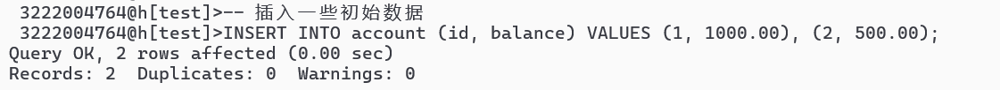
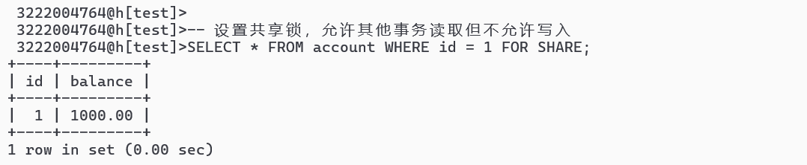
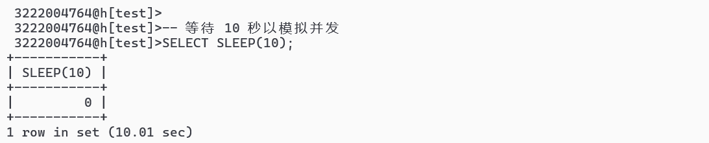
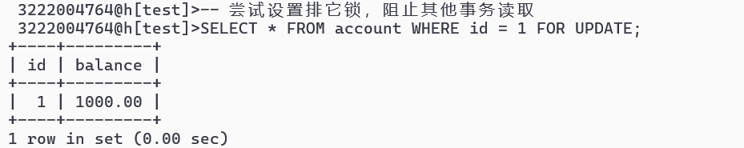
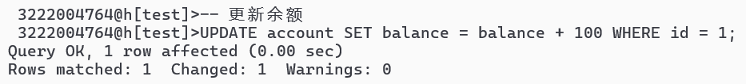

## 第十次作业

### 1.纸质完成下面内容

 P239 7，8，9，11，14 

P316 3，4，5 

P330 3，4，5 

P331 6 

P352 10，11，15 

### 2.模拟多事物之间的锁机制场景

#### ①创建新的表account，插入初始数据以方便事务进行。

#### ②开始事务1：使用共享锁

##### 设置共享锁

##### 模拟并发

##### 提交

#### ③开始事务2：使用排它锁

##### 设置排它锁

##### 其他操作

##### 提交

#### ④如果事务1要提交，可能会因为事务 2 持有排它锁而导致阻塞，可以选择回滚事务1.

