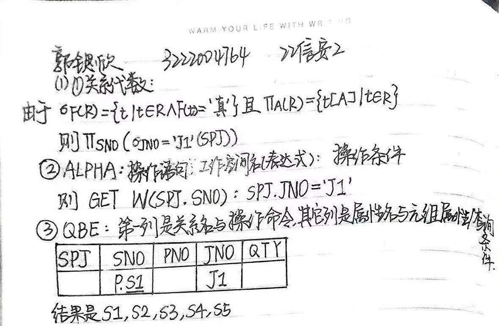
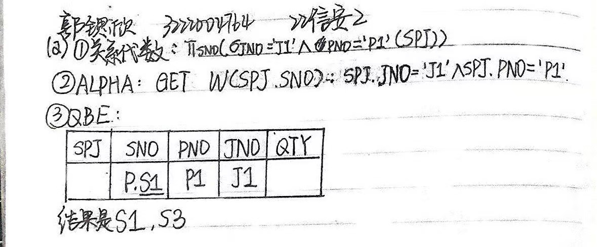
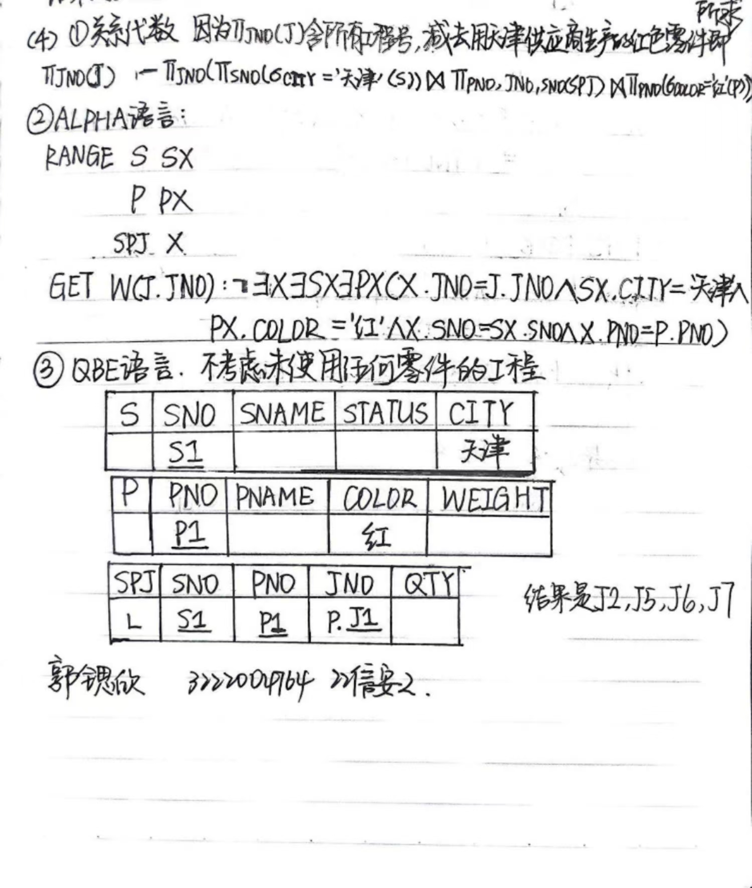
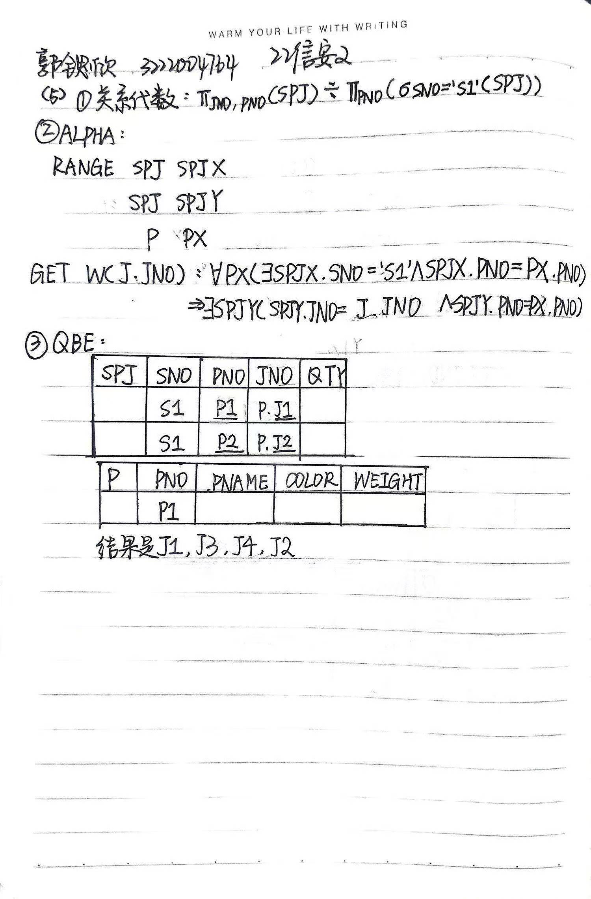

# 数据库第四次作业

第2章课后习题 5 手写作业

试用关系代数、 ALPHA 语言、 QBE 语言完成如下查询：

(1）求供应工程J1零件的供应商号码 SNO ;

(2）求供应工程J1零件P1的供应商号码 SNO ;

(3）求供应工程J1零件为红色的供应商号码 SNO ;

(4）求没有使用天津供应商生产的红色零件的工程号 JNO;

(5）求至少用了供应商S1所供应的全部零件的工程号 JNO

