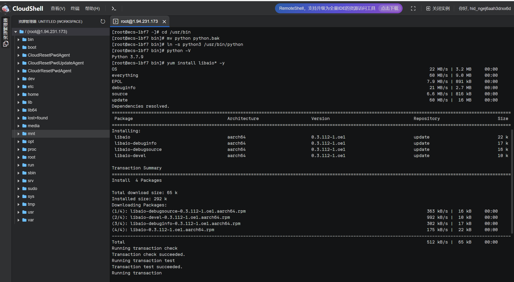
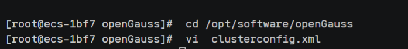
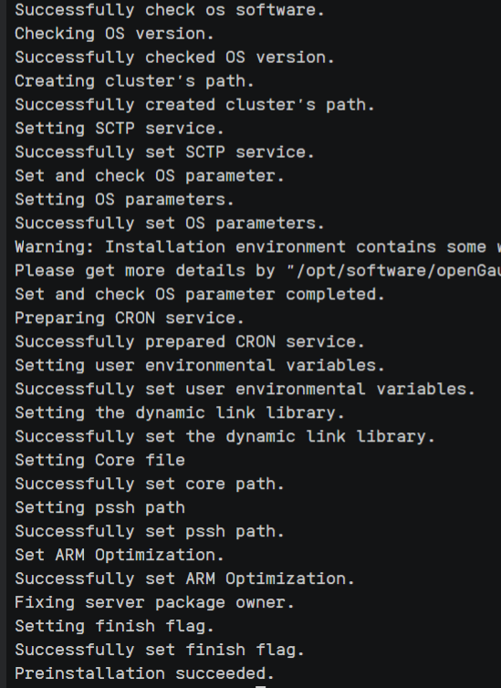
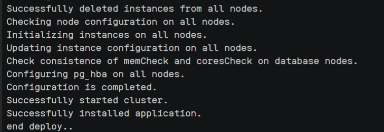

## 1.1 连接服务器

## 1.2 设置字符集参数
步骤 1	在/etc/profile文件中添加＂export LANG= en_US.UTF‐8＂

步骤 2 输入如下命令，使配置修改生效
source /etc/profile

## 1.3 修改python版本并安装libaio包
之后安装过程中openGauss用户互信，openEuler服务器需要用到Python-3.7.x命令，但是默认Python版本为Python-2.7.x，所以需要切换Python版本。

步骤 1	进入/usr/bin目录。

cd /usr/bin
备份python文件。
mv python python.bak

步骤 2	建立Python3软连接
ln -s python3 /usr/bin/python
步骤 3	验证Python版本
python -V
显示如下，即为Python版本切换成功
``` 
Python 3.7.4
```
步骤 4	Python版本切换成功，后续安装需要libaio包，下载进行安装
yum install libaio* -y

## 1.4 安装openGauss数据库
步骤 1	以root用户登录待安装openGauss的主机，并按规划创建存放安装包的目录
```
mkdir -p /opt/software/openGauss
chmod 755 -R /opt/software
```
步骤 2	下载数据库安装包到安装目录
切换到安装目录：
```
cd /opt/software/openGauss
```
使用wget下载安装包：
```
wget  https://opengauss.obs.cn-south-1.myhuaweicloud.com/2.0.0/arm/openGauss-2.0.0-openEuler-64bit-all.tar.gz
```

## 1.5创建XML配置文件
步骤 1	以root用户登录待安装openGauss的主机，切换到存放安装包的目录
```
cd /opt/software/openGauss
```
步骤 2	创建XML配置文件，用于数据库安装
```
 vi  clusterconfig.xml
```


步骤 3	输入＂i＂进入INSERT模式，添加文本如下
```
<?xml version="1.0" encoding="UTF-8"?> 
<ROOT> 
    <CLUSTER> 
        <PARAM name="clusterName" value="dbCluster" /> 
        <PARAM name="nodeNames" value="ecs-1bf7" /> 
        <PARAM name="backIp1s" value="192.168.0.108"/> 
        <PARAM name="gaussdbAppPath" value="/opt/gaussdb/app" /> 
        <PARAM name="gaussdbLogPath" value="/var/log/gaussdb" /> 
        <PARAM name="gaussdbToolPath" value="/opt/huawei/wisequery" /> 
        <PARAM name="corePath" value="/opt/opengauss/corefile"/> 
        <PARAM name="clusterType" value="single-inst"/> 
    </CLUSTER> 
   
    <DEVICELIST> 
        
        <DEVICE sn="1000001"> 
            <PARAM name="name" value="ecs-1bf7"/> 
            <PARAM name="azName" value="AZ1"/> 
            <PARAM name="azPriority" value="1"/> 
            <PARAM name="backIp1" value="192.168.0.108"/> 
            <PARAM name="sshIp1" value="192.168.0.108"/> 
             
	    <!--dbnode--> 
	    <PARAM name="dataNum" value="1"/> 
	    <PARAM name="dataPortBase" value="26000"/> 
	    <PARAM name="dataNode1" value="/gaussdb/data/db1"/> 
        </DEVICE> 
    </DEVICELIST> 
</ROOT>
```


步骤 4	点击＂Esc＂退出INSERT模式，然后输入＂:wq＂后回车退出编辑并保存文本
## 1.6初始化安装环境
步骤 1	修改performance.sh文件。
使用vi打开文件＂/etc/profile.d/performance.sh＂
步骤 2	为确保openssl版本正确，执行预安装前加载安装包中lib库
步骤 3	在安装包所在的目录下，解压安装包
步骤 4	使用gs_preinstall准备好安装环境，切换到gs_preinstall命令所在目录
步骤 5	执行ls命令查看script中内容
步骤 6	采用交互模式执行，并在执行过程中会创建openGauss omm用户互信
成功后显示为：

## 1.7执行安装
步骤 1	修改文件权限
步骤 2	登录到openGauss的主机，并切换到omm用户
步骤 3	使用gs_install安装openGauss
显示如下内容即为安装成功

# 2 创建数据库
步骤 1	在数据库主节点服务器上，切换至omm操作系统用户环境
步骤 2	查看服务是否启动
步骤 3	启动数据库服务（可选操作，如未启动，请按此步骤启动）
步骤 4	连接数据库
步骤 5	创建数据库用户
步骤 6	创建数据库
步骤 7	使用新用户连接到此数据库执行接下来的创建表等操作。当然，也可以选择继续在默认的postgres数据库下做后续的体验
步骤 8	创建名为joe的SCHEMA，并设置joe为当前的schema
步骤 9	创建表
步骤 10	向表中插入数据
步骤 11	查看表中数据。

实验结束