# 第1次实验

下载安装MySQL

## 1.打开mysql官方网站，下载压缩文件和文档

### a.点击下载/DOWNLOAD


### b.下滑至底层，点击红色框选部分的内容


### c.点击community server的版本


## d.根据自己电脑的情况以及自身需求选择对应的系统和版本，点击.zip文件旁边的download


## e.无需登陆，直接下载


## f.同时下载对应版本的文档，由于我适用的是最新版本，因此下载的是最新版本文档的pdf


### g.下载完毕后，在d盘（或者其他盘）创建mysql文件夹，把pdf文件和zip文件放入该文件夹中，zip文件解压


## 2.打开系统的命令提示符

### a.可在开始处搜索找到


### b.转换至mysql.exe文件所在的目录 直接输入d:


### c.输入dir，查看文件


### d.输入mysqld，发现第三行开始出错，原因是选择的版本mysql community server采用的是c/s模式，下载后server部分没有进行初始化，没有对应的data文件夹。


### e.初始化，输入命令mysqld --console --initialize

切记不要关闭此窗口！！！


## 3.打开另一个控制台

### a.在mysql.exe文件夹所处目录的搜索栏输入cmd


### b.输入命令mysql -u root -p并输入临时密码


### c.输入命令show databases；   但是发现出错，需要修改用户密码，故输入命令alter user 'root'@'localhost'identified by '新密码'（此处我使用的密码是abc1245）


### e.退出mysql，重新登入，输入mysql -u root -p并输入新密码，检验是否修改成功


## 4.创建用户

### a.输入prompt  \u@\h[\d]>(空格)


### b.输入create user '学号'@'localhost'identified by '用户密码'；


### c.授权，输入grant all on (星号).(星号) to '学号'@'localhost';


## d.退出exit


## 5.修改提示符

### a.输入mysql -u 刚刚创建的用户名 -p并输入密码


### b.再次输入prompt  \u@\h[\d]>(空格)


可以看见提示符已经改为学号
# 第2次实验
OpenGauss创建数据库
## 1.1 连接服务器

## 1.2 设置字符集参数
步骤 1	在/etc/profile文件中添加＂export LANG= en_US.UTF‐8＂
步骤 2 输入如下命令，使配置修改生效
source /etc/profile

## 1.3 修改python版本并安装libaio包
之后安装过程中openGauss用户互信，openEuler服务器需要用到Python-3.7.x命令，但是默认Python版本为Python-2.7.x，所以需要切换Python版本。
步骤 1	进入/usr/bin目录。
cd /usr/bin
备份python文件。
mv python python.bak
步骤 2	建立Python3软连接
ln -s python3 /usr/bin/python
步骤 3	验证Python版本
python -V
显示如下，即为Python版本切换成功
``` 
Python 3.7.4
```
步骤 4	Python版本切换成功，后续安装需要libaio包，下载进行安装
yum install libaio* -y

## 1.4 安装openGauss数据库
步骤 1	以root用户登录待安装openGauss的主机，并按规划创建存放安装包的目录
```
mkdir -p /opt/software/openGauss
chmod 755 -R /opt/software
```
步骤 2	下载数据库安装包到安装目录
切换到安装目录：
```
cd /opt/software/openGauss
```
使用wget下载安装包：
```
wget  https://opengauss.obs.cn-south-1.myhuaweicloud.com/2.0.0/arm/openGauss-2.0.0-openEuler-64bit-all.tar.gz
```

## 1.5创建XML配置文件
步骤 1	以root用户登录待安装openGauss的主机，切换到存放安装包的目录
```
cd /opt/software/openGauss
```
步骤 2	创建XML配置文件，用于数据库安装
```
 vi  clusterconfig.xml
```

步骤 3	输入＂i＂进入INSERT模式，添加文本如下
```
<?xml version="1.0" encoding="UTF-8"?> 
<ROOT> 
    <CLUSTER> 
        <PARAM name="clusterName" value="dbCluster" /> 
        <PARAM name="nodeNames" value="ecs-1bf7" /> 
        <PARAM name="backIp1s" value="192.168.0.108"/> 
        <PARAM name="gaussdbAppPath" value="/opt/gaussdb/app" /> 
        <PARAM name="gaussdbLogPath" value="/var/log/gaussdb" /> 
        <PARAM name="gaussdbToolPath" value="/opt/huawei/wisequery" /> 
        <PARAM name="corePath" value="/opt/opengauss/corefile"/> 
        <PARAM name="clusterType" value="single-inst"/> 
    </CLUSTER> 
   
    <DEVICELIST> 
        
        <DEVICE sn="1000001"> 
            <PARAM name="name" value="ecs-1bf7"/> 
            <PARAM name="azName" value="AZ1"/> 
            <PARAM name="azPriority" value="1"/> 
            <PARAM name="backIp1" value="192.168.0.108"/> 
            <PARAM name="sshIp1" value="192.168.0.108"/> 
             
        <!--dbnode--> 
        <PARAM name="dataNum" value="1"/> 
        <PARAM name="dataPortBase" value="26000"/> 
        <PARAM name="dataNode1" value="/gaussdb/data/db1"/> 
        </DEVICE> 
    </DEVICELIST> 
</ROOT>
```

步骤 4	点击＂Esc＂退出INSERT模式，然后输入＂:wq＂后回车退出编辑并保存文本
## 1.6初始化安装环境
步骤 1	修改performance.sh文件。

使用vi打开文件＂/etc/profile.d/performance.sh＂

步骤 2	为确保openssl版本正确，执行预安装前加载安装包中lib库

步骤 3	在安装包所在的目录下，解压安装包

步骤 4	使用gs_preinstall准备好安装环境，切换到gs_preinstall命令所在目录

步骤 5	执行ls命令查看script中内容

步骤 6	采用交互模式执行，并在执行过程中会创建openGauss omm用户互信

成功后显示为：


## 1.7执行安装

步骤 1	修改文件权限

步骤 2	登录到openGauss的主机，并切换到omm用户

步骤 3	使用gs_install安装openGauss

显示如下内容即为安装成功


## 2 创建数据库
步骤 1	在数据库主节点服务器上，切换至omm操作系统用户环境
步骤 2	查看服务是否启动
步骤 3	启动数据库服务（可选操作，如未启动，请按此步骤启动）
步骤 4	连接数据库
步骤 5	创建数据库用户
步骤 6	创建数据库
步骤 7	使用新用户连接到此数据库执行接下来的创建表等操作。当然，也可以选择继续在默认的postgres数据库下做后续的体验
步骤 8	创建名为joe的SCHEMA，并设置joe为当前的schema
步骤 9	创建表
步骤 10	向表中插入数据
步骤 11	查看表中数据。

实验结束
# 第3次实验
## 使用 MySQL 系统 完成教材的第三章所有sql例子实验 

#### 例3.1 为用户 WANG 定义一个学生﹣课程模式 S - T 。

CREATE SCHEMA " S - T " AUTHORIZATION WANG ;


#### 例3.2 CREATE SCHEMA AUTHORIZATION WANG ;


#### 例3.3 为用户 ZHANG 创建一个模式 TEST ，并且在其中定义一个表TAB1。 

CREATE SCHEMA TEST AUTHORIZATION ZHANG 
CREATE TABLE TAB1(COL1 SMALLINT,
COL2 INT,
COL3 CHAR (20),
COL4 NUMERIC (10,3),
COL5 DECIMAL (5,2)
);


#### 例3.4 DROP SCHEMA ZHANG CASCADE;


#### 例3.5 建立一个"学生"表 Student 。

CREATE TABLE Student 
( Sno CHAR (9) PRIMARY KEY,                                   /＊列级完整性约束条件， Sno 是主码＊/

 Sname CHAR (20) UNIQUE,                                     /* Sname 取唯一值＊/
 Ssex CHAR (2),
 Sage SMALLINT,
 Sdept CHAR (20)
);


#### 例3.6  建立一个“课程”表Course


#### 例3.7 建立学生选课表SC


#### 例3.8 向Student表增加“入学时间”列，其数据类型为日期型


#### 例3.9 将年龄数据类型由字符型改为整数

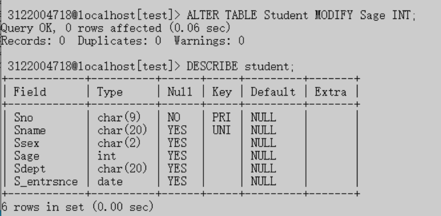

#### 例3.10 增加课程名称必须取唯一值的约束条件

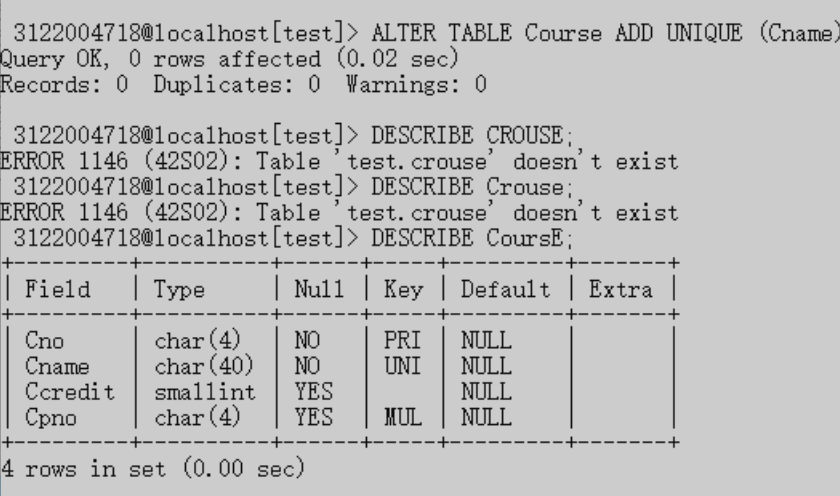

#### 例3.11 删除Student表


#### 例3.12 若表上建有视图，选择RESTRICT 时表不能删除；选择CASCADE时可以删除表，视图也自动被删除。

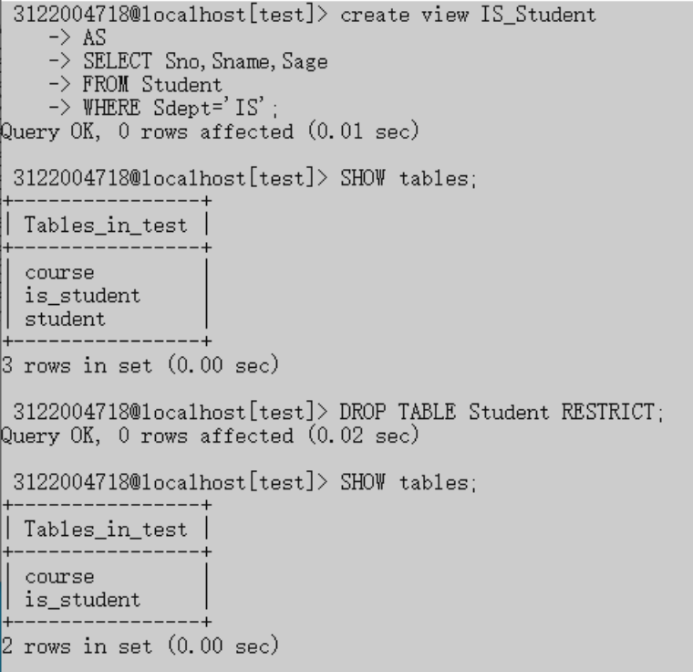

#### 例3.13 为学生﹣课程数据库中的 Student 、 Course 和 SC 三个表建立索引。

其中 Student 表按学号升序建唯一索引， Course 表按课程号升序建唯一索引， SC 表按学号升序和课程号降序建唯一索引。

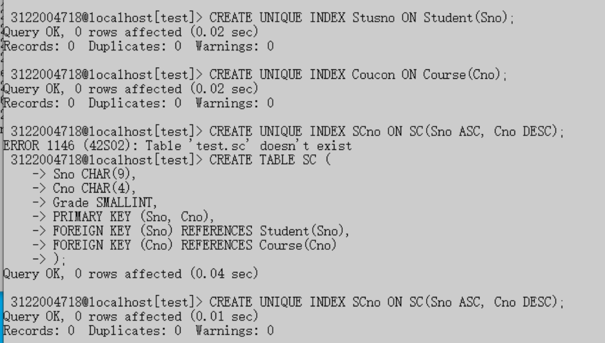


#### 例3.14 将SC表的SCno索引名改为SCSno

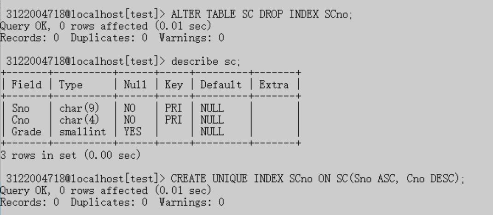

#### 例3.15 删除Student表的Stusname索引
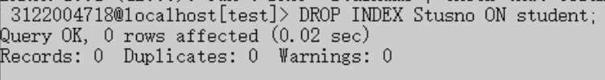


#### 例3.16 查询全体学生的学号和姓名


#### 例3.17 查询全体学生的姓名、学号、所在系

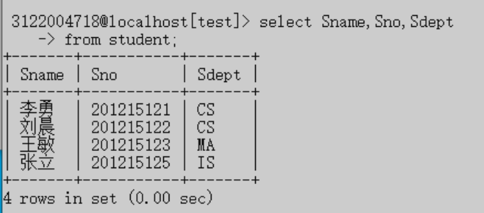

#### 例3.18 查询全体学生的详细记录

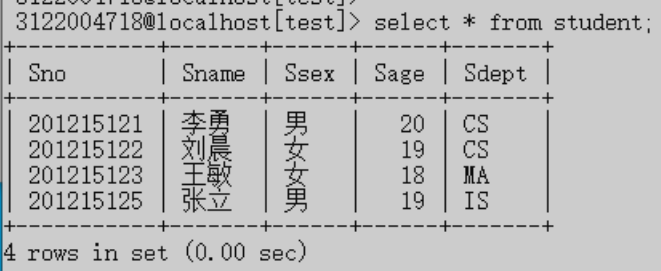

#### 例3.19 查询全体学生的姓名及其出生年份

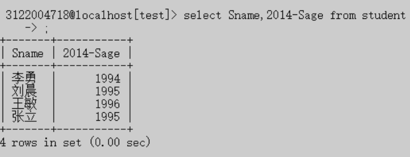

#### 例3.20 查询全体学生的姓名、出生年份和所在的院系，要求用小写字母表示系名


#### 例3.21 查询选修了课程的学生学号


#### 例3.22 查询计算机科学系全体学生的名单


#### 例3.23 查询所有年龄在20岁以下的学生姓名及其年龄


#### 例3.24 查询考试成绩不合格的学生的学号


#### 例3.25 查询年龄在20-23岁之间的学生姓名、系别和年龄


#### 例3.26 查询年龄不在20-23岁之间的学生姓名、系别和年龄


#### 例3.27 查询计算机科学系（CS）、数学系（MA）和信息系（IS）学生的姓名和性别


#### 例3.28 查询既不是计算机科学系、数学系，也不是信息系的学生的姓名和性别。


#### 例3.29 查询学号为201215121的学生的详细情况


#### 例3.30 查询所有姓刘的学生的姓名、学号和性别


#### 例3.31 查询姓“欧阳”且全名为三个汉字的学生的姓名


#### 例3.32 查询名字中第二个字为“阳”的学生的姓名和学号


#### 例3.33 查询所有不姓刘的学生的姓名、学号和性别


#### 例3.34 查询DB_Design课程的课程号和学分


#### 例3.35 查询以“DB_”开头，且倒数第三个字符为i的课程的详细情况


#### 例3.36 某些学生选修课程后没有参加考试，所以有选课记录，但没有考试成绩，查询缺少成绩的学生的学号和对应的课程号


#### 例3.37 查所有有成绩的学生学号和课程号


#### 例3.38 查询计算机科学系年龄在20岁以下的学生姓名


#### 例3.39 查询选修了3号课程的学生的学号和成绩，查询结果按照分数的降序排列


#### 例3.40 查询全体学生情况，查询结果按所在系的系号升序排列，同一系中的学生按年龄降序排列


#### 例3.41 查询学生总人数


#### 例3.42 查询选修了课程的学生人数


#### 例3.43 计算选修2号课程的学生平均成绩


#### 例3.44 查询选修1号课程的学生最高分数


#### 例3.45 查询学生201215012选修课程的总学分数


#### 例3.46 求各个课程号及相应的选课人数


#### 例3.47 查询选修了三门以上课程的学生学号


#### 例3.48 查询平均成绩大于等于90分的学生学号和平均成绩

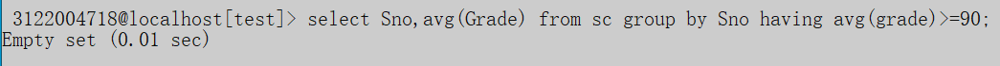

#### 例3.49 查询每个学生及其选修课程的情况


#### 例3.50 对例3.49用自然连接完成


#### 例3.51 查询选修2号课程且成绩在90分以上的所有学生的学号和姓名


#### 例3.52 查询每一门课程的间接先修课（即先修课的先修课）


#### 例3.53 执行外连接的代码


#### 例3.54 查询每个学生的学号、姓名、选修的课程名和成绩


#### 例3.55 查询与“刘晨”在同一个系学习的学生


#### 例3.56 查询选修了课程名为“信息系统”的学生学号和姓名


#### 例3.57 找出每个学生超过他自己选修课程平均成绩的课程号


#### 例3.58 查询非计算机科学系中比计算机科学系任意一个学生年龄小的学生姓名和年龄


#### 例3.59 查询非计算机科学系中比计算机科学系所有学生年龄都小的学生姓名和年龄


#### 例3.60 查询所有选修了1号课程的学生姓名


#### 例3.61 查询没有选修1号课程的学生姓名


#### 例3.62 查询选修了全部课程的学生姓名


#### 例3.63 查询至少选修了学生201215122选修的全部课程的学生号码


#### 例3.64 查询计算机科学系的学生和年龄不大于19岁的学生


#### 例3.65 查询选修了课程1或者选修了课程2的学生


#### 例3.66 查询计算机科学系的学生与年龄不大于19岁的学生的交集

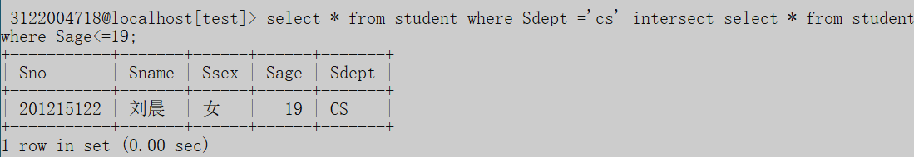

#### 例3.67 查询既选修了课程1又选修了课程2的学生。


#### 例3.68 查询计算机科学系的学生与年龄不大于19岁的学生的差集


#### 例3.69 将一个新学生元组（学号：201215128，姓名：陈冬，性别：男，所在系：IS，年龄：18岁）插入到Student表中

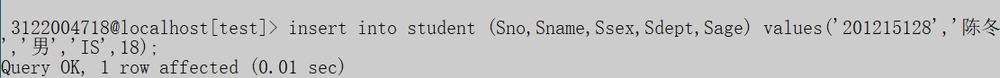

#### 例3.70 将学生张成民的信息插入到Student表中


#### 例3.71 插入一条选课记录（‘201215128’，‘1’）


#### 例3.72  对每一个系，求学生的平均年龄，再把系名和平均年龄存入新表中


#### 例3.73 将学生201215121的年龄改为22岁


#### 例3.74 将所有学生的年龄增加1岁


#### 例3.75 将计算机科学系全体学生的成绩置零


#### 例3.76 删除学号为201215128的学生记录


#### 例3.77 删除所有的学生选课记录


#### 例3.78 删除计算机科学系所有学生的选课记录


#### 例3.79 向SC表中插入一个元组，学生号是“201215126",课程号是”1“，成绩为空

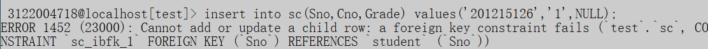

#### 例3.80 将Student表中学生号为”201215200“的学生所属的系改为空值


#### 例3.81 从Student表中找出漏填了数据的学生信息


#### 例3.82 找出选修1号的课程的不及格的学生


#### 例3.83 选出选修1号课程的不及格的学生以及缺考的学生


#### 例3.84 建立信息系学生的视图

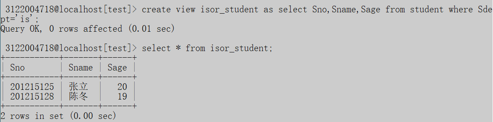

#### 例3.85 建立信息系学生的视图，并要求进行修改和插入操作时仍需保证该视图只有信息系的学生


#### 例3.86 建立信息系选修了1号课程的学生的视图（包括学号、姓名、成绩）


#### 例3.87 建立信息系选修了1号课程且成绩在90分以上的学生的视图


#### 例3.88 定义一个反映学生出生年份的视图


#### 例3.89 将学生的学号和平均成绩定义为一个视图


#### 例3.90 将Student表中所有女生的记录定义为一个视图


#### 例3.91 删除视图BT_S和视图IS_S1


#### 例3.92 在信息系学生的视图中找出年龄小于20岁的学生


#### 例3.93 查询选修了1号课程的信息系学生


#### 例3.94 在S_G（例3.89中定义）视图中查询平均成绩在90分以上的学生学号和平均成绩


#### 例3.95 将信息系学生视图IS_Student中学号为”201215122“的学生姓名改为”刘辰“


#### 例3.96 向信息系学生视图IS_Student中插入一个新的学生记录，其中学号为”201215129“，姓名为”赵新“，年龄为20岁


#### 例3.97 删除信息系学生视图IS_Student中学号为”201215129“的记录


# 第4次实验
##### 4.1


##### 4.2


##### 4.3

Mysql不支持授予权限给public


##### 4.4


##### 4.5


##### 4.6 


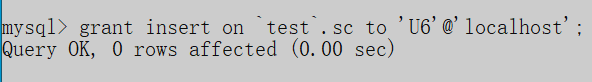

##### 4.7


##### 4.8


##### 4.9

mysql无法对pubic进行操作，只能对sc有select权限的个体进行一个个取消


##### 4.10


mysql不支持使用cascade级联取消U6U7的权限，要手动取消。

##### 4.11


##### 4.12


##### 4.13


##### 4.14


##### 4.15


##### 4.16


# 第5次实验
并发控制锁机制
1. **准备数据**：

 首先，创建一个名为 `testdb` 的数据库，并在其中创建一张名为 `account` 的表，用于模拟银行账户。
然后，向 `account` 表中插入一些初始数据：
```
INSERT INTO account (id, name, balance) VALUES
    (1, 'Alice', 1000.00),
    (2, 'Bob', 500.00);
```

2. **模拟场景**：

本实验将模拟以下几种场景，每个场景都涉及多个并发事务，以观察不同锁机制的行为。


**场景一：共享锁的兼容性**

 *  **事务 A**：`START TRANSACTION; SELECT * FROM account WHERE id = 1 FOR SHARE;`
 *  **事务 B**：`START TRANSACTION; SELECT * FROM account WHERE id = 1 FOR SHARE;`

    **步骤**：

    1. 打开两个 CMD 窗口，分别作为事务 A 和事务 B 的执行环境。
    2. 在事务 A 的窗口中执行：`START TRANSACTION;`
    3. 在事务 B 的窗口中执行：`START TRANSACTION;`
    4. 在事务 A 的窗口中执行：`SELECT * FROM account WHERE id = 1 FOR SHARE;`
    5. 在事务 B 的窗口中执行：`SELECT * FROM account WHERE id = 1 FOR SHARE;`
    6. 观察两个事务的执行结果。


**场景二：共享锁与排它锁的互斥性**

*   **事务 A**：`START TRANSACTION; SELECT * FROM account WHERE id = 1 FOR SHARE;`
*   **事务 B**：`START TRANSACTION; SELECT * FROM account WHERE id = 1 FOR UPDATE;`

    **步骤**：

    1. 打开两个 CMD 窗口，分别作为事务 A 和事务 B 的执行环境。

    2. 在事务 A 的窗口中执行：`START TRANSACTION;`

    3. 在事务 B 的窗口中执行：`START TRANSACTION;`

    4. 在事务 A 的窗口中执行：`SELECT * FROM account WHERE id = 1 FOR SHARE;


    5. 在事务 B 的窗口中执行：`SELECT * FROM account WHERE id = 1 FOR UPDATE;`

    6. 观察事务 B 的执行状态：无法加载。


**场景三：排它锁的互斥性**

*   **事务 A**：`START TRANSACTION; SELECT * FROM account WHERE id = 1 FOR UPDATE;`
*   **事务 B**：`START TRANSACTION; SELECT * FROM account WHERE id = 1 FOR SHARE;`
*   **事务 C**：`START TRANSACTION; SELECT * FROM account WHERE id = 1 FOR UPDATE;`

    **步骤**：

    1. 打开三个 CMD 窗口，分别作为事务 A、事务 B 和事务 C 的执行环境。

    2. 在事务 A 的窗口中执行：`START TRANSACTION;`

    3. 在事务 B 的窗口中执行：`START TRANSACTION;`

    4. 在事务 C 的窗口中执行：`START TRANSACTION;`

    5. 在事务 A 的窗口中执行：`SELECT * FROM account WHERE id = 1 FOR UPDATE;`

    6. 在事务 B 的窗口中执行：`SELECT * FROM account WHERE id = 1 FOR SHARE;`

    7. 在事务 C 的窗口中执行：`SELECT * FROM account WHERE id = 1 FOR UPDATE;`

    8. 观察事务 B 和事务 C 的执行状态。
    9. 在事务 A 的窗口中执行：`COMMIT;`

    10. 再次观察事务 B 和事务 C 的执行状态。
    11. 在事务 B 的窗口中执行：`COMMIT;`

    12. 再次观察事务 C 的执行状态。（无变化）

    13. 在事务 C 的窗口中执行：`COMMIT;`


**场景四：排它锁更新数据**

*   **事务 A**：`START TRANSACTION; SELECT * FROM account WHERE id = 1 FOR UPDATE; UPDATE account SET balance = balance - 100 WHERE id = 1;`
*   **事务 B**：`START TRANSACTION; SELECT * FROM account WHERE id = 1 FOR SHARE;`

    **步骤**：

    1. 打开两个 CMD 窗口，分别作为事务 A 和事务 B 的执行环境。

    2. 在事务 A 的窗口中执行：`START TRANSACTION;`

    3. 在事务 B 的窗口中执行：`START TRANSACTION;`

    4. 在事务 A 的窗口中执行：`SELECT * FROM account WHERE id = 1 FOR UPDATE;`

    5. 在事务 A 的窗口中执行：`UPDATE account SET balance = balance - 100 WHERE id = 1;`

    6. 在事务 B 的窗口中执行：`SELECT * FROM account WHERE id = 1 FOR SHARE;`

    7. 观察事务 B 的执行状态。
    8. 在事务 A 的窗口中执行：`COMMIT;`

    9. 再次观察事务 B 的执行状态
    10. 在事务 B 的窗口中执行：`COMMIT;`
