# 数据库第五次作业

## 1.继续参考视频完成 mysql的安装实验

安装已完成

## 2.使用 MySQL 系统 完成教材的第三章所有sql例子实验 

#### 例3.1 为用户 WANG 定义一个学生﹣课程模式 S - T 。

CREATE SCHEMA " S - T " AUTHORIZATION WANG ;

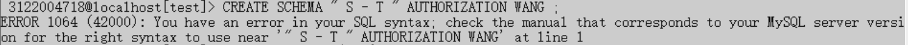

#### 例3.2 CREATE SCHEMA AUTHORIZATION WANG ;

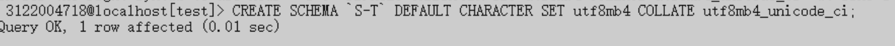

#### 例3.3 为用户 ZHANG 创建一个模式 TEST ，并且在其中定义一个表TAB1。 

CREATE SCHEMA TEST AUTHORIZATION ZHANG 
CREATE TABLE TAB1(COL1 SMALLINT,
COL2 INT,
COL3 CHAR (20),
COL4 NUMERIC (10,3),
COL5 DECIMAL (5,2)
);

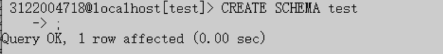

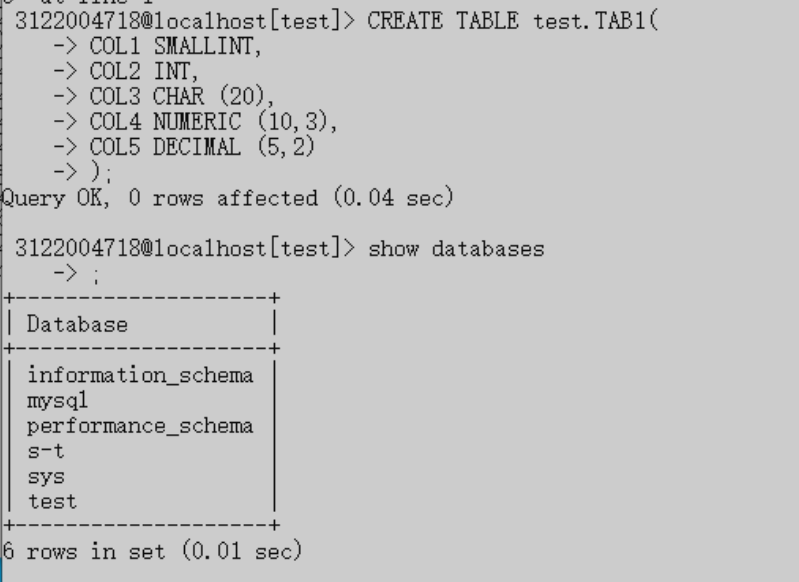

#### 例3.4 DROP SCHEMA ZHANG CASCADE;

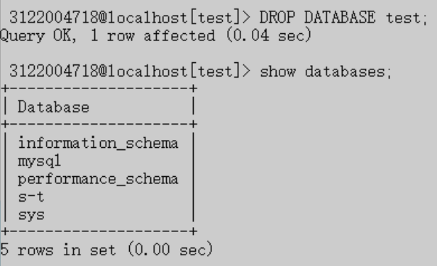

#### 例3.5 建立一个"学生"表 Student 。

CREATE TABLE Student 
( Sno CHAR (9) PRIMARY KEY,                                   /＊列级完整性约束条件， Sno 是主码＊/

 Sname CHAR (20) UNIQUE,                                     /* Sname 取唯一值＊/
 Ssex CHAR (2),
 Sage SMALLINT,
 Sdept CHAR (20)
);

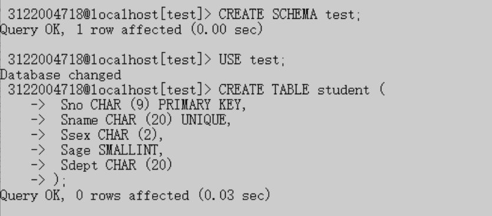

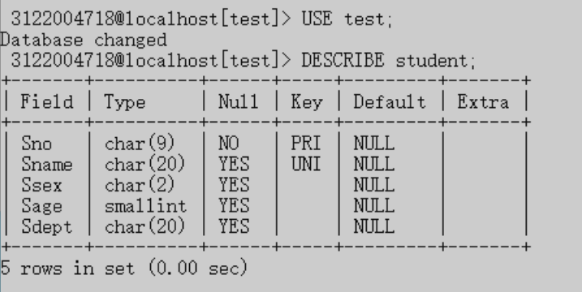

#### 例3.6  建立一个“课程”表Course

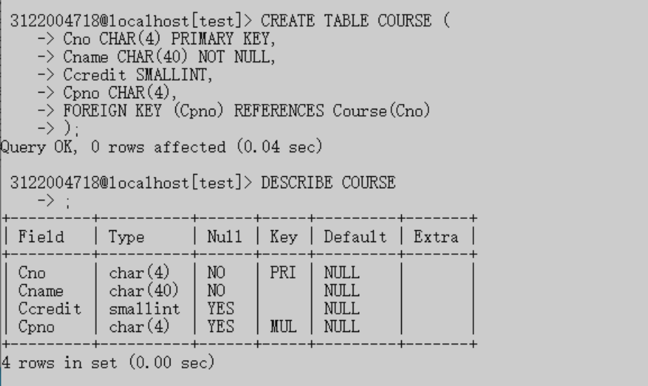

#### 例3.7 建立学生选课表SC

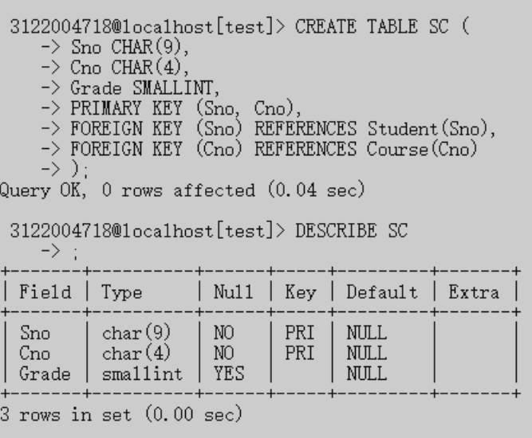

#### 例3.8 向Student表增加“入学时间”列，其数据类型为日期型

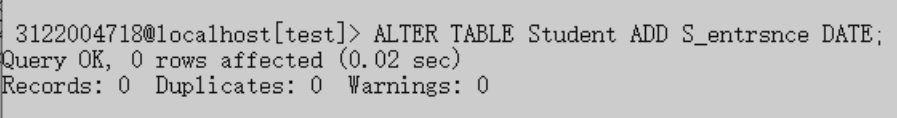

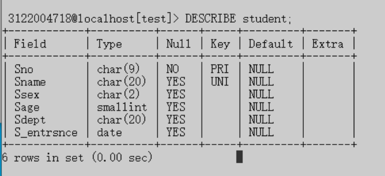

#### 例3.9 将年龄数据类型由字符型改为整数

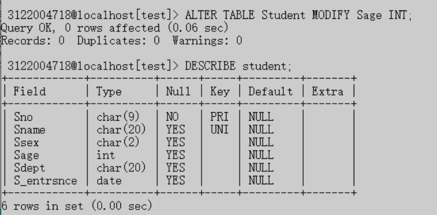

#### 例3.10 增加课程名称必须取唯一值的约束条件

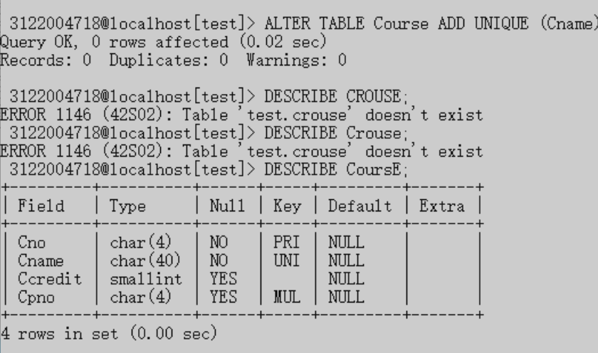

#### 例3.11 删除Student表

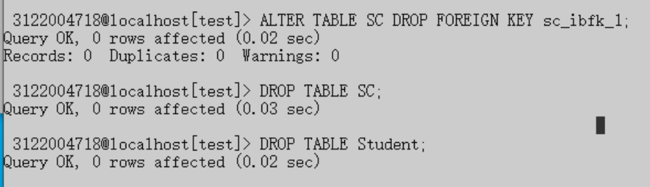

#### 例3.12 若表上建有视图，选择RESTRICT 时表不能删除；选择CASCADE时可以删除表，视图也自动被删除。

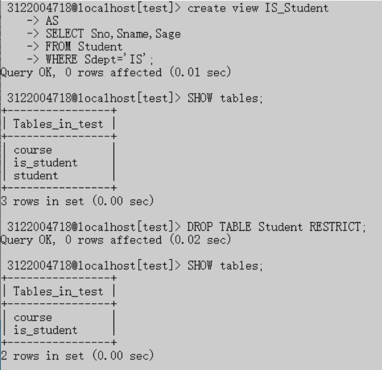

#### 例3.13 为学生﹣课程数据库中的 Student 、 Course 和 SC 三个表建立索引。

其中 Student 表按学号升序建唯一索引， Course 表按课程号升序建唯一索引， SC 表按学号升序和课程号降序建唯一索引。

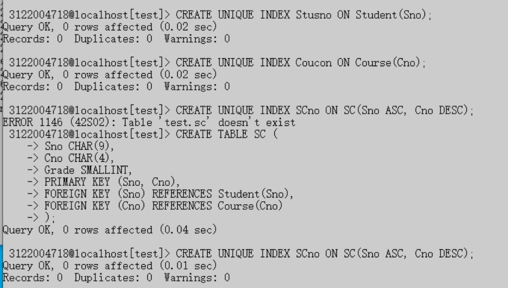

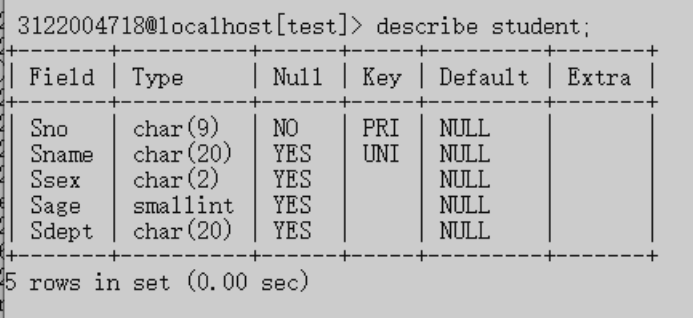

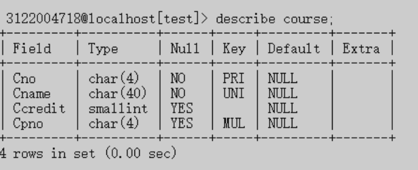

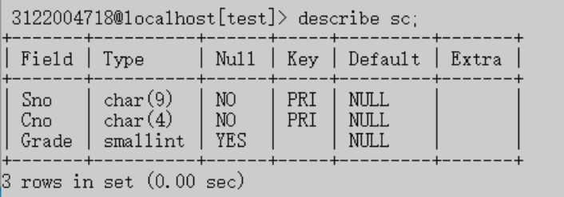

#### 例3.14 将SC表的SCno索引名改为SCSno

#### 例3.15 删除Student表的Stusname索引

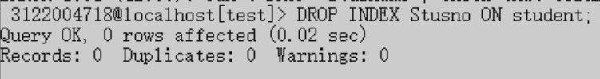

#### 例3.16 查询全体学生的学号和姓名

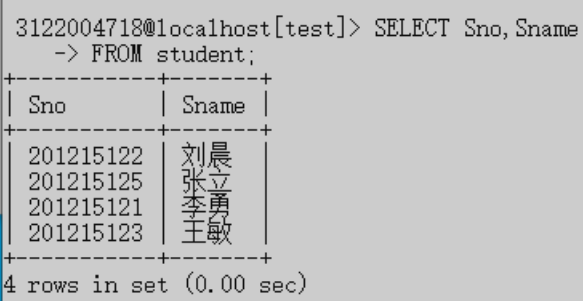

#### 例3.17 查询全体学生的姓名、学号、所在系

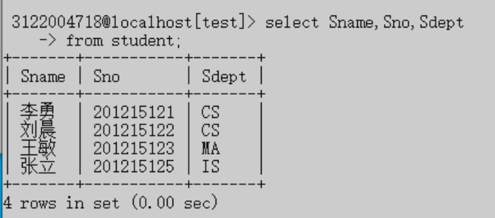

#### 例3.18 查询全体学生的详细记录

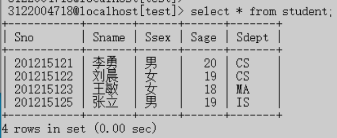
#### 例3.19 查询全体学生的姓名及其出生年份
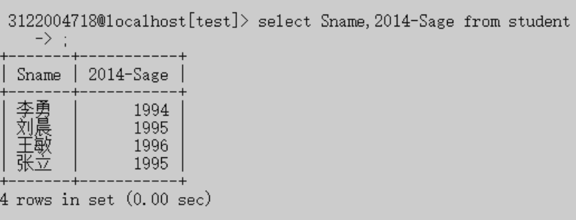
#### 例3.20 查询全体学生的姓名、出生年份和所在的院系，要求用小写字母表示系名
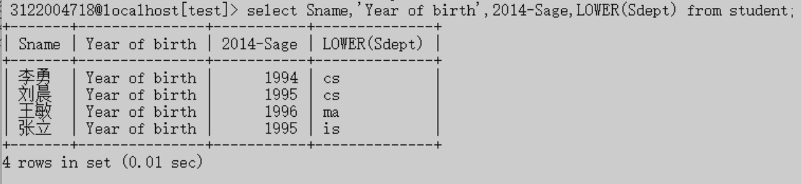
#### 例3.21 查询选修了课程的学生学号